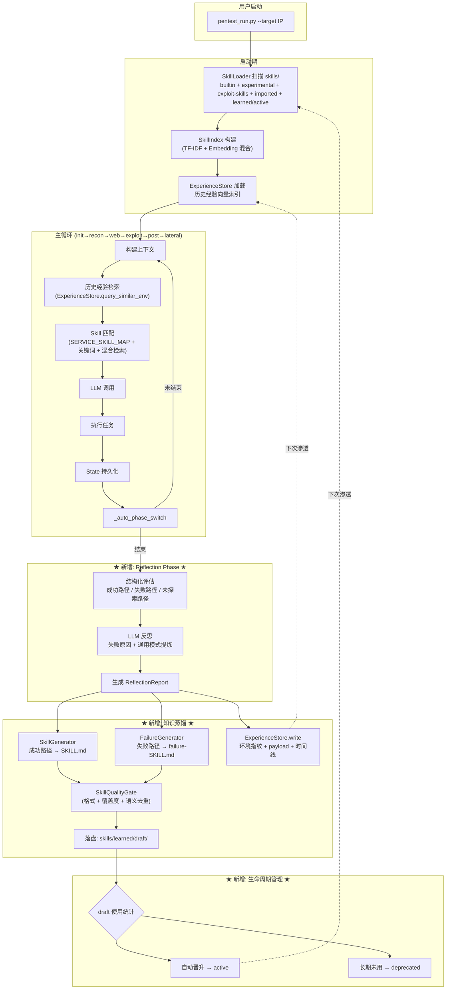

# SDIT 自进化闭环架构设计方案

> 基于 `D:\agent-new` 现状的自进化 Agent 闭环架构设计  
> 目标：让 SDIT 渗透 Agent 实现 **感知 → 决策 → 行动 → 反思 → 沉淀 → 复用** 的完整学习闭环  
> 状态：设计稿 v1.0 — 2026-06-24

---

## 0. 设计哲学

**一句话**：把现在的"线性渗透流水线"改造成"带记忆与反思的螺旋上升"，**不动现有 6 阶段执行核心**，所有进化能力以"叠加层"形式插入。

**三条铁律**：

1. **零数据伪造**：Reflection 与 ExperienceStore 只记录真实 State 中的事件，不允许 LLM 生成"假想的成功路径"
2. **故障安全**：进化层任何环节失败都必须降级到原有行为（生成 skill 失败 → 不影响报告生成；embedding 加载失败 → 降级到 TF-IDF）
3. **预算隔离**：Reflection / 经验检索的 LLM 调用必须有独立 token 配额，不能侵占主循环的 12K 预算

---

## 1. 闭环数据流图



**集成点（精确到行）**：

| 环节 | 文件 | 现状行号 | 修改类型 |
|------|------|---------|---------|
| ExperienceStore 加载 | `agent.py:357-360` | 357 | 新增 `experience_store = ExperienceStore(SKILLS_ROOT)` |
| 历史经验检索 | `agent.py:410` 之前 | 410 | 在 skill 匹配前插入 `experience_hits = experience_store.query_similar_env(...)` |
| Skill 混合检索 | `skill_matcher.py:118-156` | 118 | 替换 `_get_vector_index()` 为支持 embedding 的实现 |
| Reflection 触发 | `agent.py:4374-4378` | 4374 | `_advance("reflection", ...)` 替代直接 `_advance("done", ...)` |
| Reflection 主体 | `agent.py:run()` 主循环内 | 654 | `if new_phase == "reflection": _run_reflection(state, llm_client); new_phase = "done"` |
| Skill 生成质量门控 | `agent.py:683` | 683 | `generated_skills = quality_gate.filter(generated_skills)` |
| 生命周期管理 | 新增 `skills/learned/.lifecycle.json` | — | 新文件 |

---

## 2. 语义检索系统（RAG）设计

### 2.1 Embedding 方案选型

| 方案 | 优点 | 缺点 | 决策 |
|------|------|------|------|
| **sentence-transformers** (paraphrase-multilingual-MiniLM-L12-v2) | 中英文双语，~120MB，本地完整 | 首次启动慢、torch 依赖重 | 候选 |
| **FastEmbed (BAAI/bge-small-zh-v1.5)** | ONNX 后端轻量 ~30MB，启动快 | 中文专精，英文略弱 | **选定** |
| **OpenAI text-embedding-3-small** | 效果最好 | 违反"纯本地"约束 | 否决 |
| **纯 TF-IDF（现状）** | 零依赖、200ms 构建 | 无语义、754 skills 命中率低 | 保留作降级 |

**Rationale**：FastEmbed 在 Windows + Python 3.13 上经 `pip install fastembed` 即可用，ONNX Runtime CPU 模式下单条 embedding < 5ms，符合"检索 < 100ms"约束。bge-small-zh 中文能力强，覆盖 SDIT 754 个 imported（中英混合）skills。**放弃 sentence-transformers** 的主因是 torch 在 Windows 上对 Python 3.13 支持不稳，且我们的 skill 文本平均 < 2K 字符，bge-small 已经够用。

### 2.2 向量存储

```
skills/.cache/
  embeddings/
    skills.npy         # (N, 384) float32, mmap 加载
    skills_meta.json   # [{name, path, sha256, ts}, ...]
    .lock              # 防止并发构建
```

**索引策略**：
- **全量构建时机**：首次启动 + `skills/` 目录有新增/删除文件时（用 `sha256(name + mtime)` 集合差异判定）
- **增量更新**：SkillGenerator 写入 `skills/learned/active/` 后，调用 `index.add_incremental(skill_path)`，追加单条 embedding 到 `.npy`
- **存储格式**：纯 numpy `.npy` + 内存 mmap，**不引入 FAISS/chromadb**
  - 754 skills × 384 dim × 4 bytes ≈ 1.1 MB，cosine 全量扫描 < 10ms
  - 引入 FAISS 收益不大，依赖却很重（Windows 编译麻烦）

**Rationale**：FAISS 适合 100K+ 量级，我们当前 < 1K skills，纯 numpy 完全够用。等到 ExperienceStore 累积超过 10K 条经验时再考虑切到 FAISS。

### 2.3 混合检索（RRF 融合）

```python
def match(query: str, limit: int = 6) -> list[SkillMatch]:
    # 阶段 1: 现有 SkillMatcher 评分（service map + 关键词 + 标签 + 域）
    score_kw = self._keyword_score(query)        # dict[skill_name -> float]
    
    # 阶段 2: TF-IDF (现有 SkillIndex)
    score_tfidf = self._tfidf_index.search(query, top_k=20)
    
    # 阶段 3: Embedding (新增)
    score_emb = self._embedding_index.search(query, top_k=20)
    
    # 阶段 4: RRF 融合（Reciprocal Rank Fusion）
    # 每个排名 k 贡献 1/(60+k)，对极端高分稳健
    fused: dict[str, float] = {}
    for rank, (name, _) in enumerate(sorted(score_kw.items(), key=lambda x: -x[1])):
        fused[name] = fused.get(name, 0) + 1.0 / (60 + rank)
    for rank, (name, _) in enumerate(score_tfidf):
        fused[name] = fused.get(name, 0) + 1.0 / (60 + rank)
    for rank, (name, _) in enumerate(score_emb):
        fused[name] = fused.get(name, 0) + 1.0 / (60 + rank)
    
    # 阶段 5: SERVICE_SKILL_MAP 强约束 boost（保留现有逻辑）
    for service_key, skill_name in SERVICE_SKILL_MAP.items():
        if service_key in query.lower():
            fused[skill_name] = fused.get(skill_name, 0) + 0.5  # 显著 boost
    
    # 排序、归一化到 0-20 分（与现有量纲一致）
    ranked = sorted(fused.items(), key=lambda x: -x[1])[:limit]
    max_score = ranked[0][1] if ranked else 1.0
    return [SkillMatch(skill, score=20.0 * v / max_score) for name, v in ranked]
```

**Rationale**：选 RRF 而非加权求和，因为：
- 三路分数量纲完全不同（关键词命中是 0-30 整数，TF-IDF 是 0-1 余弦，embedding 也是 0-1 余弦），加权需要调三个 α
- RRF 只看排名不看绝对分，对异常值稳健，工业界主流选择
- 实现简单，调试容易

### 2.4 检索触发时机

| 时机 | 当前 | 新增 |
|------|------|------|
| 每轮主循环 | `agent.py:411` `matcher.match(query)` | 改为混合检索，逻辑透明 |
| 阶段切换时 | 无 | 不增加，避免重复 |
| recon 阶段开始 | 无 | **新增** ExperienceStore.query_similar_env() 查历史相似环境 |

### 2.5 知识库条目设计

除了 SKILL.md，新增 **ExperienceEntry**：

```python
@dataclass
class ExperienceEntry:
    id: str                              # uuid
    timestamp: str                       # ISO8601
    target_fingerprint: dict             # {os, services, versions, open_ports}
    successful_paths: list[AttackPath]   # 完整成功路径（recon→exploit→post）
    failed_attempts: list[FailedAttempt] # 失败的攻击尝试及原因
    duration_rounds: int                 # 总轮次
    duration_sec: float
    skills_used: list[str]               # 命中过的 skill 名
    payloads: dict                       # 有效的 payload 与前置条件
    environment_notes: str               # LLM 提炼的环境特征
    embedding: list[float]               # 384 维向量
```

**存储**：`skills/.experience/<date>/<id>.json` + `skills/.cache/experience.npy`

---

## 3. Reflection Phase 设计

### 3.1 阶段定位

**新增第 7 阶段**：`PHASE_ORDER = [init, recon, web, exploit, post, lateral, reflection, done]`

进入 reflection 的条件 = 原 done 的条件（在 `_auto_phase_switch` 中把所有 `_advance("done", ...)` 改为 `_advance("reflection", ...)`，并在 reflection 完成后强制 `_advance("done")`）。

### 3.2 触发条件

**无条件触发**（失败也要学习）。但 reflection 内部根据状态决定做什么：

| State 状态 | reflection 行为 |
|-----------|----------------|
| 有 active session 或 vulnerability | 生成成功路径 skill + 经验条目 |
| 有 finding 但无 exploit | 生成"未利用攻击面"备忘 + 经验条目 |
| 啥都没有 | 只生成失败经验条目（不生成 skill） |

### 3.3 输入数据

```python
@dataclass
class ReflectionInput:
    state: State                         # 完整 state
    timeline: list[TimelineEvent]        # 从 actions_taken 提取的时间线
    online_search_results: list          # 本次渗透的联网查询
    tool_success_rate: dict[str, float]  # 各工具成功率
```

### 3.4 处理流程

```python
def _run_reflection(state, llm_client, online_search, exp_store) -> ReflectionReport:
    # Step 1: 结构化评估（纯代码，无 LLM）
    evaluation = StructuredEvaluator().evaluate(state)
    # evaluation.successful_paths: 完整 kill chain
    # evaluation.failed_paths: 失败但有信号的路径（与 actions_taken.failure_reason 关联）
    # evaluation.unexplored: candidate_tasks 中状态 != completed 的攻击面

    # Step 2: LLM 反思（独立预算 3K token，单次调用）
    if llm_client and evaluation.has_signal():
        reflection_prompt = build_reflection_prompt(evaluation, budget=3000)
        llm_insights = llm_client.call(reflection_prompt)  # JSON: {patterns, root_causes, recommendations}
    else:
        llm_insights = None

    # Step 3: Skill 生成
    skills_to_write = []
    if evaluation.successful_paths:
        skills_to_write += SkillGenerator(...).generate_from_paths(evaluation.successful_paths)
    if evaluation.failed_paths and llm_insights:
        skills_to_write += FailureSkillGenerator(...).generate(evaluation.failed_paths, llm_insights)

    # Step 4: 质量门控
    accepted = SkillQualityGate().filter(skills_to_write)

    # Step 5: 落盘（draft 目录）
    written = []
    for skill in accepted:
        path = write_skill_md(skill, root=Path(SKILLS_ROOT)/"learned"/"draft")
        written.append(path)

    # Step 6: 经验入库
    experience_entry = build_experience_entry(state, evaluation, llm_insights)
    exp_store.add(experience_entry)

    return ReflectionReport(
        evaluation=evaluation,
        llm_insights=llm_insights,
        skills_written=written,
        experience_id=experience_entry.id,
    )
```

### 3.5 LLM Reflection Prompt 模板（关键设计）

```
你正在分析一次渗透测试的完整过程。请基于以下真实事件做反思（不要假想任何未发生的事件）：

## 成功路径（{n} 条）
{successful_paths_summary}

## 失败尝试（{m} 条）
{failed_paths_summary}

## 未探索的攻击面
{unexplored_surfaces}

请输出 JSON：
{
  "root_cause_analysis": [           // 失败根因（仅基于 failed_attempts，禁止脑补）
    {"failure": "...", "likely_cause": "...", "evidence_line": "..."}
  ],
  "generalizable_patterns": [        // 通用模式（基于成功路径，可推广到类似环境）
    {"pattern": "...", "applies_when": "...", "skill_name_hint": "..."}
  ],
  "recommendations_for_next_run": [  // 下次类似环境的建议（写入 ExperienceEntry）
    "..."
  ]
}

重要：所有 JSON 字段值必须有 State 中的对应证据。如果某项找不到证据，宁可输出空数组也不要编造。
```

### 3.6 输出

```python
@dataclass
class ReflectionReport:
    evaluation: StructuredEvaluation
    llm_insights: Optional[LLMInsights]
    skills_written: list[Path]
    experience_id: str
    skipped_skills: list[tuple[str, str]]  # [(skill_name, reject_reason)]
    duration_sec: float
    tokens_used: int
```

### 3.7 预算控制

- **结构化评估**：纯代码，0 token
- **LLM 反思**：独立 3K token，单次调用（与主循环 12K 隔离）
- **总耗时上限**：30 秒（hard timeout），超时降级到只生成结构化报告

**Rationale**：放弃"多轮 LLM 反思"是因为我们已经在主循环里耗费了大量 token，reflection 阶段必须收敛快。单次 3K 输入 + 1K 输出（JSON）已经足够提炼通用模式。

---

## 4. Skill 自动生成与生命周期管理

### 4.1 生成触发

- **自动**：reflection 阶段触发（统一入口）
- **手动**：API `POST /api/skills/generate?session_id=xxx`（运维场景）
- **CLI 工具**：`python -m app.cli regenerate_skills --state <state.json>`（回放历史 state）

### 4.2 质量门控（SkillQualityGate）

四个独立检查器，**任一失败即拒绝**（拒绝原因写入 ReflectionReport.skipped_skills 供人工复核）：

```python
class SkillQualityGate:
    def filter(self, skills: list[GeneratedSkill]) -> list[GeneratedSkill]:
        accepted = []
        for s in skills:
            if not self._check_frontmatter(s):
                self._reject(s, "frontmatter 缺字段")
                continue
            if not self._check_v2_sections(s):
                self._reject(s, "五段式章节不完整")
                continue
            if self._is_duplicate(s):
                self._reject(s, f"与 {self._dup_name} 语义重复 (cosine={self._dup_score:.2f})")
                continue
            if not self._check_grounding(s):
                self._reject(s, "包含未在 state 中出现的 CVE/payload，疑似幻觉")
                continue
            accepted.append(s)
        return accepted

    def _check_frontmatter(self, s):
        # 必填: name, description, domain, subdomain, version='2.0'
        return all(k in s.frontmatter for k in REQUIRED_KEYS)

    def _check_v2_sections(self, s):
        # 五段式: Principle, Detection Fingerprint, Workflow, Failure Modes, Generalization
        return all(sec in s.body for sec in V2_SECTIONS)

    def _is_duplicate(self, s):
        # 用 embedding 与现有 active skills 比对，cosine > 0.85 视为重复
        existing = self.index.search(s.description, top_k=5)
        return existing and existing[0].score > 0.85

    def _check_grounding(self, s):
        # CVE 和 payload 必须在 state.online_search_results 或 state.actions_taken 中出现过
        cves = extract_cves(s.body)
        return all(cve in self.state_evidence for cve in cves)
```

**Rationale**：`_check_grounding` 是关键防幻觉机制——LLM 在生成 SKILL.md 时容易"补充"看起来合理但实际未验证的 CVE 编号，必须用 state 证据反查。

### 4.3 生命周期状态机

```
       initial            promote               retire
draft  ──────►  draft   ─────────►  active   ─────────►  deprecated
                  │                     ▲
                  │ negative-feedback   │ used_successfully
                  ▼                     │
              rejected ◄────────────────┘
                                  manual override
```

状态文件 `skills/learned/.lifecycle.json`：

```json
{
  "exploit-apache-2449-traversal": {
    "status": "draft",
    "created_at": "2026-06-24T10:00:00",
    "used_count": 0,
    "successful_uses": 0,
    "last_used": null,
    "promoted_at": null
  }
}
```

**自动晋升规则**：
- `successful_uses >= 2` AND `created_at` 距今 > 1 天 → 移动到 `skills/learned/active/`，状态 active
- `created_at` 距今 > 30 天 AND `used_count == 0` → 移动到 `skills/learned/deprecated/`，状态 deprecated
- 主循环每次成功使用一个 learned skill（即该 skill 出现在 round_plan 且对应 action 成功），写回 `successful_uses += 1`

### 4.4 目录结构（新）

```
skills/learned/
  draft/            # 初次生成（默认）
  active/           # 验证过的（晋升后）
  deprecated/       # 过期归档
  .lifecycle.json   # 状态机
```

`SkillLoader` 默认加载 `draft + active`（不加载 deprecated），保证已验证 skill 优先级更高（draft 加 status='draft' 标记，匹配评分时降 0.5 boost）。

---

## 5. 知识库写入设计（ExperienceStore）

### 5.1 写入内容

每次渗透写一条 `ExperienceEntry`（见 §2.5），包含：
- **环境指纹**：OS / 服务 / 版本 / 开放端口集合
- **有效 payload**：来自 `state.actions_taken` 中 `status='completed'` 且 `evidence` 非空的动作
- **失败记录**：`state.actions_taken` 中 `status='failed'` 的动作及 failure_reason
- **时间线**：每个里程碑的轮次和耗时

### 5.2 存储格式

```
skills/.experience/
  2026/06/24/
    a1b2c3d4.json         # ExperienceEntry 序列化
  .cache/
    experience.npy        # (N, 384) embedding 矩阵
    experience_meta.json  # [{id, path, ts, fingerprint_hash}, ...]
```

**Rationale**：用文件系统而非 SQLite 是因为：
- 每条 entry < 50KB，扁平 JSON 易于人工 review
- 不增加数据库依赖
- 备份/共享简单（zip 整个目录给同事就能复用）

### 5.3 检索接口

```python
class ExperienceStore:
    def query_similar_env(
        self,
        target_fingerprint: dict,  # {os, services, versions}
        top_k: int = 3,
    ) -> list[ExperienceEntry]:
        """在 recon 阶段结束后调用，返回历史上最相似环境的成功经验"""
        query_text = self._fingerprint_to_text(target_fingerprint)
        query_vec = self._encoder.encode(query_text)
        scored = cosine_sim(self._matrix, query_vec)
        top = np.argsort(-scored)[:top_k]
        return [self._load(self._meta[i]["id"]) for i in top if scored[i] > 0.5]

    def render_for_prompt(self, entries: list[ExperienceEntry], budget: int = 1500) -> str:
        """渲染为可注入 LLM 上下文的简洁摘要"""
        # 输出格式: "## 历史相似环境经验\n- 2026-05-20 类似 Linux+Apache 2.4.49 → 成功路径: dirtraversal → RCE..."
```

### 5.4 主循环集成点

```python
# agent.py: 在 recon → web 或 recon → exploit 跃迁后立刻触发一次
if state.previous_phase == "recon" and state.phase in ("web", "exploit"):
    fingerprint = state.build_target_fingerprint()
    history_hits = experience_store.query_similar_env(fingerprint, top_k=3)
    if history_hits:
        state.attach_history_context(history_hits)  # 写入 state，下一轮 llm_context() 自动注入
```

### 5.5 容量控制

- **去重**：写入前用 `fingerprint_hash` 检查，相同指纹的更新而非新增
- **过期淘汰**：超过 1 年且 6 个月未被检索命中 → 归档到 `experience/archive/<year>/`
- **手动管理**：CLI `python -m app.cli experience list/delete/export`

---

## 6. 关键代码变更清单

按 **文件 → 变更** 列出：

### 6.1 新增文件

| 路径 | 类型 | 描述 |
|------|------|------|
| `src-python/app/services/skill_engine/skill_embedding_index.py` | 新增 | FastEmbed 向量索引，与 `SkillIndex` 同接口 |
| `src-python/app/services/skill_engine/quality_gate.py` | 新增 | `SkillQualityGate` 类，四道检查 |
| `src-python/app/services/skill_engine/lifecycle_manager.py` | 新增 | draft/active/deprecated 状态机 |
| `src-python/app/services/skill_engine/failure_skill_generator.py` | 新增 | 失败经验 → failure-XXX SKILL.md |
| `src-python/app/services/pentest_agent/reflection.py` | 新增 | Reflection 阶段主入口 `_run_reflection()` + `StructuredEvaluator` |
| `src-python/app/services/experience_store/__init__.py` | 新增 | 包入口 |
| `src-python/app/services/experience_store/store.py` | 新增 | `ExperienceStore` + `ExperienceEntry` |
| `src-python/app/services/experience_store/encoder.py` | 新增 | 共享 FastEmbed 编码器单例 |
| `src-python/tests/test_reflection.py` | 新增 | reflection 阶段单元测试 |
| `src-python/tests/test_quality_gate.py` | 新增 | 质量门控单元测试 |
| `src-python/tests/test_experience_store.py` | 新增 | 经验库单元测试 |
| `src-python/tests/test_skill_embedding_index.py` | 新增 | embedding 索引测试 |

### 6.2 修改文件

| 路径 | 行号 | 修改 |
|------|------|------|
| `agent.py` | 23 | 添加 `from app.services.experience_store import ExperienceStore` |
| `agent.py` | 357-360 | 新增 `experience_store = ExperienceStore(SKILLS_ROOT)` |
| `agent.py` | 411 | `matcher.match()` 内部启用混合检索（透明） |
| `agent.py` | ~440 (recon→web/exploit 跃迁后) | 调用 `experience_store.query_similar_env()` |
| `agent.py` | 654 | `if new_phase == "reflection": _run_reflection(...)` |
| `agent.py` | 665-697 | 整段移到 `reflection.py` 内 |
| `agent.py` | 4308 | `PHASE_ORDER` 加入 `"reflection"` |
| `agent.py` | 4374-4378 | post → done 改为 post → reflection |
| `skill_matcher.py` | 31, 108-156 | 集成混合检索（RRF） |
| `skill_matcher.py` | 118-124 | `_get_vector_index()` 改为返回 `HybridIndex(tfidf, embedding)` |
| `skill_loader.py` | (扫描逻辑) | 默认加载 `learned/draft + learned/active`（不加载 deprecated） |
| `skill_generator.py` | 824 行末 | 输出目录从 `learned/` 改为 `learned/draft/` |
| `state.py` | 22-100 | `TokenBudget.QUOTAS` 新增 `"experience": 800` |
| `state.py` | 975 | `llm_context()` 加入 history_context 区块（如果 attached） |
| `state.py` | 118 | `State.attach_history_context()` 新方法 |
| `state.py` | 118 | `State.build_target_fingerprint()` 新方法 |

### 6.3 删除文件

无（向后兼容）。

### 6.4 依赖关系

```
ExperienceStore     ──depends─→  shared FastEmbed encoder
SkillEmbeddingIndex ──depends─→  shared FastEmbed encoder
SkillQualityGate    ──depends─→  SkillEmbeddingIndex (用于去重)
Reflection          ──depends─→  StructuredEvaluator, SkillGenerator, FailureSkillGenerator,
                                  SkillQualityGate, LifecycleManager, ExperienceStore
agent.py            ──depends─→  Reflection, ExperienceStore
```

**关键解耦点**：FastEmbed 加载失败时，`encoder` 返回 None，所有依赖它的模块降级到 TF-IDF（已有）+ 跳过 embedding 相关检查（embedding-based dedup 改为基于 description 的字符串相似度）。

---

## 7. 分阶段实施路线图

### P0 — 学习闭环固化（预计 1-2 天）

**目标**：当前 SkillGenerator 已接入但缺质量保障；本阶段补齐 + 引入 draft 目录。

**交付物**：
1. `skill_engine/quality_gate.py` — SkillQualityGate（前 3 道检查：frontmatter / v2-sections / 字符串相似度去重）
2. `skill_engine/lifecycle_manager.py` — 状态机基础设施
3. `skill_engine/failure_skill_generator.py` — 失败经验 skill 生成
4. `skills/learned/draft/` + `skills/learned/active/` 目录
5. `agent.py:683` 插入 quality_gate
6. `skill_loader.py` 兼容新目录布局
7. 单元测试

**验证标准**：
- 跑一次 `pentest_run.py --target 192.168.136.143 --local`，新生成的 skill 全部进 draft
- `_check_grounding` 在 P0 暂不启用（依赖 P2 的 state.evidence_index），用前 3 道质量门
- 旧的 19 个 exploit-skills + 754 imported skills 命中率不变（回归测试）

### P1 — 语义检索升级（预计 1-2 天）

**目标**：从 TF-IDF → embedding + 混合检索

**交付物**：
1. `pip install fastembed` 加到 `requirements.txt`
2. `skill_engine/skill_embedding_index.py` — bge-small-zh embedding 索引
3. `experience_store/encoder.py` — 共享单例
4. `skill_matcher.py` — 集成 RRF 混合检索
5. embedding 缓存 `.npy` + meta 持久化
6. 启动期增量构建逻辑（sha256 diff）
7. 单元测试 + 性能基准（200 skills 索引 < 5 秒、查询 < 100ms）

**验证标准**：
- 启动期 embedding 构建（754 + 25 skills）< 8 秒
- 查询 "Apache 2.4.49 path traversal" 能命中 `exploit-apache-http`（之前 TF-IDF 命中率不稳）
- 现有的 `SERVICE_SKILL_MAP` boost 保持有效

### P2 — Reflection Phase（预计 2-3 天）

**目标**：新增第 7 阶段 + 结构化评估 + LLM 反思

**交付物**：
1. `pentest_agent/reflection.py` — 完整 reflection 主体
2. `agent.py` PHASE_ORDER 改造、_auto_phase_switch 改造
3. `state.py` 新增 `build_target_fingerprint()` 和 evidence_index（供 _check_grounding 用）
4. `skill_engine/quality_gate.py` 启用第 4 道 `_check_grounding`
5. 单元测试：mock state → 期望 ReflectionReport

**验证标准**：
- 一次完整渗透产生一份 ReflectionReport（写到 `reports/reflection_<ts>.json`）
- 失败情况下也产生 report（只是 skills_written 为空）
- LLM 反思 token < 4K，耗时 < 30s
- ReflectionReport.skipped_skills 有内容时打印日志提示

### P3 — 经验复用闭环（预计 2-3 天）

**目标**：ExperienceStore + recon 阶段历史检索

**交付物**：
1. `experience_store/store.py` + `encoder.py`
2. `agent.py` 在 recon 跃迁后调用 `query_similar_env()`
3. `state.py:attach_history_context()` + `TokenBudget.experience` 额度
4. CLI `python -m app.cli experience list/delete/export`
5. 单元测试：写入 → 读取 → 相似度查询往返
6. 端到端测试：跑两次同一靶机，第二次应在 user prompt 中看到第一次的成功路径摘要

**验证标准**：
- 第二次跑同样的 Metasploitable target，第二轮起 `state.llm_context()` 中出现 `## 历史相似环境经验` 区块
- 经验库大小可控（每次渗透 < 100KB JSON + 1.5KB embedding）
- Token 预算未超 12K + 800 = 12.8K

---

## 约束验证清单

| 约束 | 满足方式 |
|------|---------|
| 纯本地运行 | FastEmbed ONNX 本地，无外部 API |
| 增量改造 | 6 阶段保留 + reflection 作为第 7 阶段叠加，原 done 行为不变 |
| Token 预算 | 主预算保持 12K，experience 区块 +800，reflection LLM 独立 3K |
| 向后兼容 | 19 个 exploit-skills + 754 imported skills 加载路径不变 |
| 可测试 | 每个新模块带 mock 单测，不依赖真实渗透环境 |
| 性能 | bge-small-zh CPU < 5ms / 条，754 skills 全量索引 < 8 秒 |

---

## 风险与回退策略

| 风险 | 回退 |
|------|------|
| FastEmbed 加载失败（torch/onnx 冲突） | encoder=None，降级到 TF-IDF + 字符串相似度去重 |
| 生成的 skill 质量差 | 全部留在 draft/，不污染 active；通过日志告警，人工 review |
| LLM 反思超时 | 30 秒 hard timeout，跳过 LLM 反思，只生成结构化报告 |
| ExperienceStore 错乱 | 文件级存储，单文件损坏只丢一条，meta.json 重建 |
| 性能退化 | embedding 索引 mmap，启动后驻留内存；查询缓存 |

---

> 设计完。下一步：按 P0 → P1 → P2 → P3 顺序实施。每个 P 完成后跑一次端到端验证再进下一个。
